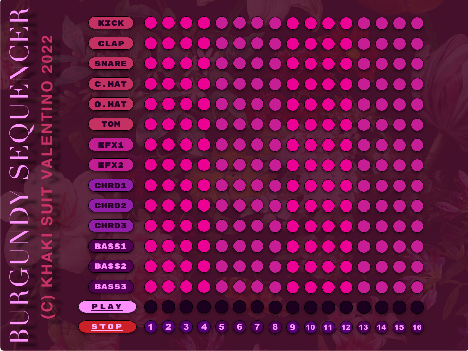

<h1> Burgundy Sequencer </h1>

<h3> Installation Instructions: </h3>

 1) Fork and clone this repository.   2) Follow the instructions <a href="https://cs.hofstra.edu/docs/pages/guides/InstallingPygame.html">here to install PyGame.</a>   3) In your command line/terminal, run <code>python3 main.py</code> to begin. Alternatively, open in VSCode or another IDE program and run it from there.

<h3> Description: </h3>

 The Burgundy Sequencer is a music application that allows users to create rhythmic sequences. Users interact with a grid-based system to "code" rhythms for one-shot samples of audio to play in a loop. Players can create drum sequences, musical arpeggios, or other pieces of music.

 

<h3> Tech Stack: </h3>

 Burgundy Sequencer is powered by PyGame, which itself is powered by Python3. 

<h3> Wireframe: </h3>

<h3> User Stories: </h3>

 As a user, I want to...   -Have a selection of sounds to choose from in my sequencer   - Use the sequencer grid to create a rhythm   Have a play button to start and stop the sequence   Be able to choose the tempo of the rhythm

<h3> MVP Goals: </h3>

-Create a selection of sounds for users to choose from   -Use the sequencer grid to program a rhythm   -Have the sequence loop to the beginning seamlessly after completion, to create an infinite musical loop   -Have a "play" button to start and stop the loop sequence   -Have a way to change the BPM (tempo) of the loop sequence 

<h3> Stretch Goals: </h3>

-create multiple sound banks for users to enjoy -allow users to upload their own sounds -create audio effect features, such as an echo effect -allow users to save their loops
